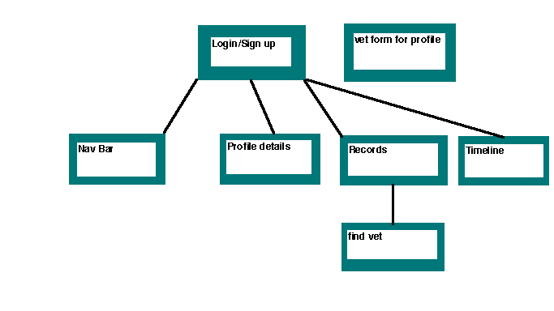
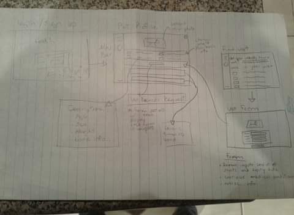

# 🐕🐕🐕🐕🐕🐕🐕 Fetch 🎾 🎾 🎾 🎾 🎾 🎾

[]()

### Premise
fetch aims to keep your all of your pets information in a organized app. This 
information can be accessed by any service that may require it to perform their services
i.e. grooming, international borders, kenels, etc...


### Description
Fetch allows you to sign up/login to a specific profile for your pet.  Witihn this profile you can list various things from eating habits, when they were recently groomed, age, sex, type of dog, picture, etc.... An aditional feature that is being implemented into the app is your animals vet records.  This information is accessed by sending a request to either a vet that you recently visited, or have visited in the past.  A special key will sent by email and will allow the vet to view a specific form on the website to be filled out. Once finished by the vet, your fury friends records will now be available to whoever may need them.

### User Story
Have you ever had issue with keeping track of your vet records? did they get lost in a move or did you change vets? this may not seem like an issue until you need to get your vet groomed, cross the border, or even take them to a new vet.  Fetch allows user to create a profile that lists specific details about your pets habits and various vets records.  This profile makes using any service that requires detailed information about your pet in order to use thier services, a seemless process. An additonal feature Fetch offers is a request to vets to acquire up to date or older records that will be displayed in your pets records section.

### Features
| Feature | Description |
| ------ | ------ |
| **login/Sign up** | - this allows users to login or sign up on the landing page |
| **Profile** | - allows you to see profile pic, generic information about pet, timeline details, vet records(if available)|
| **Add new photo** | - when user settings is clicked on profile pic settings, it allows users to upload new profile pic |
| **Add new/delete timeline event** | - this allows you add or delete a generic timeline card |
| **Request vet records** | - when request within vet records section, it will redirect you to vets in your area page.
|| - once at find vet page, a user can either find a vet in their area that they recently visited, but dont know their information, or if they know there information they can enter it into a form input.
|| - once a vet is found, the user can then send a request for their vet records by email to the vet.
| **Vet form** | - once vet recieves request for records from user. the vet will be redirected to a specific url within the email with a form to be filled out.
|| - this form will consist of various shots the animal recieved with their corosponding exipry dates, medical issues i.e. allergies, skin conditions, etc..., and various other medical conditions worth mentioning

### Stretch Features
| Feature | Description |
| ------ | ------ |
| **Vet login** | this allows vets to login into a vet specific profile to view which pets are using fetch. |
| **Calednar** | this allows users to keep track of their pets important dates i.e. grooming appointments, vet visits, etc... |


### Tech

**fetch uses many open source projects:**
**Front-End:**
 * [ReactRouter](https://reacttraining.com/react-router/core/guides/philosophy) - for SPA  UI navigation
 * [React](https://reactjs.org/) - JavaScript library for building UI interface
 * [SCSS](https://sass-lang.com/) - for styling app
  
**Back-End:**
* [node.js](https://nodejs.org/en/) - evented I/O for the backend 
* [Express](https://www.npmjs.com/package/express) - fast node.js network app framework   
* [body-parser](https://www.npmjs.com/package/body-parser) - middleware for parsing incoming request bodies
* [cors](https://www.npmjs.com/package/cors)
* [express](https://www.npmjs.com/package/cors)
* [mysql2](https://www.npmjs.com/package/mysql2)
* [sequelize](https://www.npmjs.com/package/sequelize)
* [sequelize-cli](https://www.npmjs.com/package/sequelize-cli)
* [jsonwebtoken](https://www.npmjs.com/package/jsonwebtoken)
* [bcrypt](https://www.npmjs.com/package/bcrypt)
* [MongoDB](https://www.mongodb.com/)

### Data Description
- upon going to the site, a form will be filed out for loging in or signing up
- once in your profile you can add data about your pet i.e. age, sex, breed, etc.... This data will be stored in the details key within the profile object
- users will also be able add and delete timeline cards 
- users can add profile/background pictures
- the biggest feature of all is that users can request vet records from specific vets.  This data will be submited to a records endpoint that is linked to your pets profile id.

**Front-End**

[]()

**Back-End**
**End Points:**
```sh
/profiles
```
| Method | Details |
| ------ | ------ |
|POST| new user
|DELETE| delete user

```sh
/profiles/:profileId
```
| Method | Details |
| ------ | ------ |
|GET| pet details 
|POST| add pet details 
|PUT|modify specific date i.e. timeline cards, photos, etc...
|DELETE| delete timeline cards, photos, and various pet details

```sh
/profiles/:profileId/records
```
| Method | Details |
| ------ | ------ |
|POST| adds records from vet form

```sh
/profiles/:profileId/records/:recordId
```
| Method | Details |
| ------ | ------ |
|GET| gets record data based on record id
|DELETE| deletes records specified by record id

**Databases: MongoDB**

**Expected Schemas:**
```sh
const profiles = [
    {id: 1, username:'AAA', password:123},
    {id: 2, username:'AAA', password:123},
    {id: 3, username:'AAA', password:123}
]
```
```sh
const details = {
    background_photo: 'doge.jpg',
    profile_photo: 'doge.jpg',
    age: 6,
    date_of_birth: 'july 07 2012',
    sex: 'male',
    good_boy_status: true,
    breed: 'golden retriever',
    owner: 'Bill Smith',
    
}
```
```sh
const timelineCard = {
    id: 1
    date: new Date(),
    event: 'PetsMart grooming',
    details: 'went in for grooming today! new haircut looks lit'
}
```
```sh
const record = {
    id: 101,
    date_of_visit: 1543799466,
    misc: 'Skip had a good visit today, overall a good boy'
    weight: '55 lbs',
    conditions = [
        {
            id: 1,
            condition: 'Arthritis',
            comments: 'Skip is experiencing issues in his right rear leg'
        },
        {
            id: 2,
            condition: 'Arthritis',
            comments: 'Skip is experiencing issues in his right rear leg'
        }
    ]
    shots = [
        {
            id: 1,
            shot: 'rabies vaccination',
            date_issued: 1543799466,
            date_expired: 1543799466
        }, 
        {
            id: 2,
            shot: 'rabies vaccination',
            date_issued: 1543799466,
            date_expired: 1543799466
        }
    ]
}
```

**Wireframe:**


[]()

### Project Timeline (Dec 3 - 12, 2018)

**Monday**: Figure out mongoDB and refine schemas  
**Tuesday**: setup up mock data on MongoDB and start on server with endpoints  
**Wednesday**: create React app and set up React router to hit end points  
**Thursday**: test endpoints with postman and add auth to my app  
**Friday**: work on styling to get a feel for how to app UI will look  
**Saturday/Sunday**: work further on styling components and form validation on the front end  
**Monday**: check in with educstors to work on any issues i may be having and attmept to fix  
**Tuesday**: fix any bugs and deploy the app for demo day on the 12th  


  
